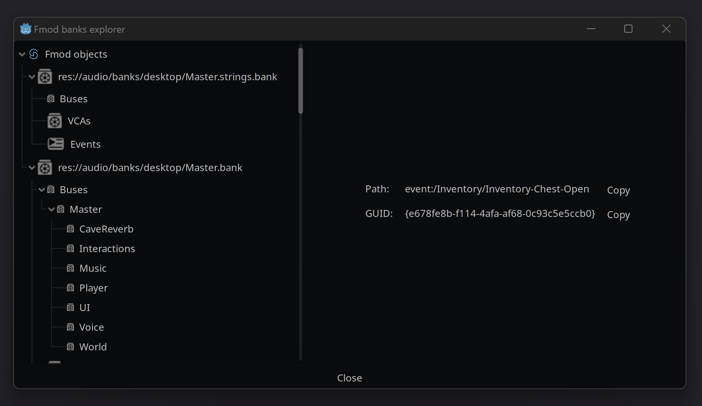

 

---

**Godot 4 GDExtension that integrates with the FMOD Studio API.** [FMOD is an audio engine and middleware solution](https://www.fmod.com/) for interactive audio in games. It has been the audio engine behind many
titles such as **Transistor**, **Into the Breach** and **Celeste**. This Godot extension is used by games such as [Koira](https://dont-nod.com/en/games/koira/).

If you need any help, you can join our [Discord Server](https://discord.com/invite/u2NM2vTGMn).

# Installation

1. [Download Latest Release](https://github.com/utopia-rise/fmod-gdextension/releases/latest)
    - (optional) access latest build for [Godot 3.x](https://github.com/utopia-rise/fmod-gdextension/archive/refs/heads/godot-3.x.zip), [Godot 4.x](https://github.com/utopia-rise/fmod-gdextension/archive/refs/heads/master.zip)
2. Unpack the `addons/fmod` folder into your `/addons` folder within the Godot project
3. Enable this addon within the Godot settings: `Project > Project Settings > Plugins`

#### Read the [official docs](https://fmod-gdextension.readthedocs.io/en/latest/) to get started with this addon.

# Features

## 🔉 Seamless integration with FMOD

Use FMOD Studio to create bank files this addon will auto-load all events for you inside Godot Engine. Live updating works out of the box.

## 🔉 Dedicated Godot nodes

This GDExtension provides nodes such as `FmodEventEmitter2D`, `FmodEventEmitter3D`, `FmodEventListener2D` and `FmodEventListener3D` that can be used in any Godot scene or GDScript code.

# Contributing

In order to be able to PR this repo from a fork, you need to add `FMODUSER` and `FMODPASS` secrets to your fork repo.  
This enables CI to download FMOD api.

Feel free to raise pull requests. We hope you'll enjoy this addon!

## How this extension works

This GDExtension exposes most of the Studio API functions to Godot's GDScript and also provides helpers for performing
common functions like attaching Studio events to Godot nodes and playing 3D/positional audio.

> **Note:** This plugin doesn't provide C# bindings to FMOD. There is technically a C# FMOD API but we choose to develop it as a C++ GDExtension. Any language binding with a auto-binding feature for extensions should be able to use this plugin, which is the case for GDScript. C# doesn't offer this feature yet.

## Continuous Delivery

This project uses [Github Actions](https://github.com/features/actions) to continuously deploy released drivers. If you do not want to use those releases, you
can compile from sources by looking to [compile from sources section](./docs/src/doc/advanced/1-compiling.md). This project uses [SEMVER](https://semver.org/).

# Special Thanks

This project is a forked from [godot-fmod-integration](https://github.com/alexfonseka/godot-fmod-integration)
from [alexfonseka](https://github.com/alexfonseka). We'd like to thank him for the work he did, we simply adapted his
work to GDNative.

# Tested Versions

- **Godot Version:** 4.4 stable
- **FMOD Version:** 2.03

[fmodsingleton]: .README/fmodsingleton.png
[usecustombuild]: .README/usecustombuild.png
